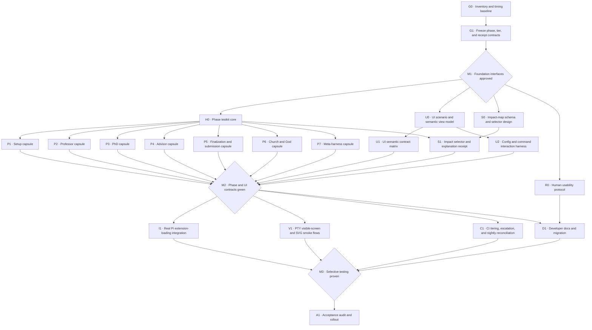

# Goal: Phase-Isolated, Impact-Selected UI/UX Testing

## Goal

Build a fast, explainable testing system for the kydoresearch Pi extension that
lets contributors validate one research phase or UI surface without running the
entire repository suite, while retaining conservative cross-phase and nightly
full-suite confidence.

The primary unit of selection is a **research phase**, not merely a changed
file. File-import analysis, a repository-owned semantic impact map, and explicit
developer intent are combined to select the smallest defensible test set.

## Intended outcomes

After this goal is complete, contributors can run commands equivalent to:

```text
npm run test:phase -- setup
npm run test:phase -- professor
npm run test:phase -- phd
npm run test:phase -- advisor
npm run test:phase -- finalization
npm run test:phase -- church
npm run test:phase -- metaharness
npm run test:phase -- ui

npm run test:related
npm run test:explain
npm run test:full
```

Narrower segments should be supported where they have an independent contract,
for example:

```text
professor:proposal
setup:baseline-review
phd:implementation
finalization:submission
```

Every selective run emits a receipt listing:

- changed files and any explicitly declared phase;
- selected tests and the reason each was selected;
- skipped suites;
- escalation decisions;
- the commit and timestamp of the latest successful full-suite run when known.

## Fixed constraints

- Preserve the existing Pi extension as the interactive control plane.
- Keep the orchestration core Pi-independent.
- Do not create a second state machine for tests.
- Phase tests must exercise production task builders, validators, persistence,
  and phase implementation. Extract a production seam when necessary; do not
  duplicate orchestration logic in a test harness.
- Pi workers remain fresh and sessionless. Test fixtures represent durable
  filesystem state rather than child conversations.
- Never invoke paid models, real leaderboard submission, or real leaderboard
  sync from automated tests.
- Use the existing mock challenge, fake Pi executable, deterministic runners,
  and injected ports.
- Preserve legacy state, proposal, resume, God/church, and configuration
  migration behavior.
- Unknown or ambiguous impact escalates conservatively instead of silently
  skipping tests.
- A full suite remains required for releases, scheduled reconciliation, and
  changes that cross shared lifecycle or evaluator boundaries.
- Do not add automatic commits or claim that a test worktree is an operating
  system sandbox.
- Preserve unrelated working-tree changes.

## Testing model

Each phase capsule has the same shape:

```text
frozen durable input fixture
  -> real production phase seam
  -> deterministic injected ports
  -> durable phase output
  -> phase-specific assertions
  -> immediate boundary compatibility assertion
  -> stop
```

The immediate boundary assertion proves that the next phase can consume the
output. It does not execute that next phase.

Examples:

- Setup persists a valid readiness/fidelity result that initialization can
  consume, but does not run Professor.
- Professor persists canonical proposals that can become PhD tasks, but does
  not create worktrees or run implementations.
- PhD produces a bounded candidate result and integrity evidence, but does not
  run Professor or finalist selection.
- Finalization consumes frozen completed candidate archives, but does not
  generate new proposals.
- UI consumes frozen durable state and never launches research work.

## Dependency DAG



## Parallel execution lanes

The DAG supports four primary implementation lanes after `M1`:

| Lane | Ownership | Initial work | Follow-on work |
|---|---|---|---|
| A · Testkit and selection | Phase harness and selector infrastructure | `H0`, `S0` | `S1`, selector tests, receipts |
| B · UI/UX | Semantic UI and component interaction | `U0` | `U1`, `U2`, `V1` |
| C · Early research phases | Setup and Professor | `P1` | phase-specific refinements and fixtures |
| D · Execution and terminal phases | PhD, Advisor, finalization, church, meta-harness | `P3`–`P7` | boundary and recovery cases |

`R0` can run independently after `M1` and should be assigned to someone not
making the first UI implementation, reducing confirmation bias in the human
study protocol.

To minimize merge conflicts:

- Lane A owns `test/support/phase-*`, the selector implementation, and impact
  metadata.
- Lane B owns `test/ui/` and PTY artifacts.
- Each phase capsule owns a distinct `test/phases/<phase>/` directory.
- One integration owner updates shared package scripts and CI configuration
  after `M2`; phase workers do not edit those shared files concurrently.
- Production refactors are assigned by file ownership before work begins.

## Work packages

### G0 — Inventory and timing baseline

**Dependencies:** none  
**Parallelizable:** no; establishes the shared baseline  
**Likely files:** test inventory documentation only

- [x] Record the duration of each current test file and the full suite.
- [x] Classify every test as phase-local, adjacent-boundary, cross-cutting,
      package/install, or full-loop.
- [x] Map current slow setup, subprocess, Git, and retry fixtures.
- [x] Identify tests that mix fast UI assertions with slow repository setup.
- [x] Record the current minimum and pinned Pi versions.
- [x] Propose measurable time budgets without weakening correctness coverage.

**Exit criteria**

- Every existing test belongs to at least one phase or cross-cutting category.
- The slowest suites and setup costs are visible.
- Baseline results are reproducible without paid models or real submissions.

### G1 — Freeze phase, tier, and receipt contracts

**Dependencies:** `G0`  
**Parallelizable:** no; downstream work consumes these contracts  
**Likely files:** new types or documentation under the goal/test-support area

Define:

- stable phase IDs and optional segment IDs;
- test tiers: `kernel`, `phase-contract`, `phase-flow`, `integration`, `pty`,
  and `full`;
- the phase-case fixture envelope;
- adjacent-boundary expectations;
- selector reason codes;
- receipt schema;
- full-suite escalation rules.

**Exit criteria**

- Adding a new phase or test tier has a documented schema and validation path.
- No downstream worker needs to invent phase naming or receipt semantics.
- `M1` records agreement on the interfaces before parallel work starts.

### H0 — Phase testkit core

**Dependencies:** `M1`  
**Parallelizable:** yes, with `U0`, `S0`, and `R0`  
**Likely files:** `test/support/phase-testkit/`

- [x] Implement typed fixture loading and temporary durable-state setup.
- [x] Provide deterministic AgentRunner, ChallengeAdapter, ExecPort, clock,
      delay, and abort controls.
- [x] Provide a boundary-stop mechanism that does not add a test-only branch to
      production behavior.
- [x] Capture state writes, journal events, runner calls, commands, logs, and
      externally visible effects.
- [x] Provide retry, abort, restart, and resume helpers.
- [x] Reject fixture paths that escape the test root.
- [x] Add self-tests proving isolation, cleanup, determinism, and no paid calls.

Where orchestration logic is currently private, extract the smallest
port-driven production handler required by both the Orchestrator and tests.
The Orchestrator remains the lifecycle owner.

**Exit criteria**

- A phase case can execute production behavior from a frozen input and stop at
  its declared boundary.
- Testkit self-tests prove no following phase ran.
- Parallel cases use independent repositories and state directories.

### U0 — UI scenario and semantic view model

**Dependencies:** `M1`  
**Parallelizable:** yes  
**Likely files:** `extensions/autoresearch/widget.ts`, `test/ui/fixtures.ts`

- [x] Define canonical scenarios from real `Phase`, `IdeaStatus`,
      initialization, recovery, steering, fidelity, and meta-harness types.
- [x] Introduce a semantic dashboard model shared by plain and styled
      projections if tests demonstrate parity risk.
- [x] Assign priority to facts and actions so narrow rendering is intentional.
- [x] Keep TUI and RPC meaning equivalent.
- [x] Preserve color-independent icons and labels.

**Exit criteria**

- Scenarios do not duplicate production state types.
- Plain and styled renderers consume one semantic meaning.
- Critical operator questions are representable as assertions.

### S0 — Impact-map schema and selector design

**Dependencies:** `M1`  
**Parallelizable:** yes  
**Likely files:** new selector schema and design tests

- [x] Define mappings from paths and semantic contracts to phases and tiers.
- [x] Define precedence for explicit `--phase`, changed-file inference, Vitest
      dependency analysis, and risk-map additions.
- [x] Define conservative escalation for unknown files and shared boundaries.
- [x] Define stale-full-suite handling.
- [x] Define a dry-run/explain mode before writing the executor.

**Exit criteria**

- Representative diffs have deterministic expected selections.
- A file can map to multiple phases without losing any required suite.
- Unknown production files select the full suite.

### R0 — Human usability protocol

**Dependencies:** `M1`  
**Parallelizable:** yes; independent of implementation  
**Likely files:** `docs/goals/phase-isolated-testing-system/usability-protocol.md`

- [x] Define representative Pi-experienced, new-to-kydoresearch, keyboard-only,
      and low-vision participant profiles.
- [x] Define task-based mock-challenge scenarios for initialization, fidelity,
      candidate diagnosis, steering, pause/restart/resume, submission awareness,
      and configuration.
- [x] Define measures for task success, time to orientation, unsafe
      misunderstanding, confidence, and perceived ease.
- [x] Define facilitator and note-taking scripts.
- [x] Keep participant testing outside automated CI.

**Exit criteria**

- The protocol can be run without real model spend or leaderboard effects.
- Safety misunderstandings are recorded separately from ordinary usability
  friction.

### P1 — Setup capsule

**Dependencies:** `H0`  
**Parallelizable:** yes, with all other phase capsules  
**Likely files:** `test/phases/setup/`, focused production seams if required

Cover:

- manifest and Git readiness;
- setup evidence and successful-log selection;
- full/reduced local-evaluation decisions;
- valid effective command persistence;
- baseline-review decision input/output;
- genuine external blockers;
- retry, abort, resume, and legacy initialization checkpoints;
- Setup output compatibility with initialization readiness.

Must not run Professor, candidate worktrees, the research loop, or submission.

### P2 — Professor capsule

**Dependencies:** `H0`  
**Parallelizable:** yes  
**Likely files:** `test/phases/professor/`

Cover:

- immutable Professor task construction;
- ledger and selected raw-evidence references;
- operator steering capture;
- explicit parent validation;
- canonical proposal normalization and legacy `{ "title", "spec" }`;
- falsifiability, evidence references, portfolio limits, and duplicate handling;
- retry, abort, resume, and proposal idempotency;
- Professor output compatibility with candidate/PhD task construction.

Must not run PhD implementations, verification, benchmarks, or finalization.

### P3 — PhD capsule

**Dependencies:** `H0`  
**Parallelizable:** yes  
**Likely files:** `test/phases/phd/`

Cover:

- immutable candidate task and applicable instruction snapshots;
- declared-parent materialization including deletions;
- bounded implementation attempts;
- verifier-context retry tasks;
- changed-path integrity;
- focused correctness ownership;
- postmortem and terminal archive behavior local to the candidate;
- PhD output compatibility with candidate evaluation records.

Must not run Professor, the serialized performance benchmark, finalist
selection, or submission.

### P4 — Advisor capsule

**Dependencies:** `H0`  
**Parallelizable:** yes  
**Likely files:** `test/phases/advisor/`

Cover:

- read-only evidence inputs;
- concern and blocker parsing;
- seeded true-positive and false-positive cases;
- advisory failure fallback;
- pause boundary behavior;
- no writes, implementation, benchmark, or submission.

### P5 — Finalization and submission capsule

**Dependencies:** `H0`  
**Parallelizable:** yes  
**Likely files:** `test/phases/finalization/`

Cover:

- direction-aware candidate ordering;
- main editable-surface snapshot and finalist application;
- finalist re-verification and re-benchmarking;
- finalist fallback and main restoration;
- submission reconciliation, retry exhaustion, ambiguity, and idempotency;
- terminal state and history compatibility.

Consume frozen sealed candidate archives. Do not run Professor or PhD.

### P6 — Church and God capsule

**Dependencies:** `H0`  
**Parallelizable:** yes  
**Likely files:** `test/phases/church/`

Cover:

- dry-streak trigger and disabled trigger;
- immutable church task construction;
- warm, honest, hopeful God role contract without search-controller behavior;
- note persistence and next-direction output;
- abort/resume including legacy `god` state;
- non-fatal church fallback.

Must not create new candidate work.

### P7 — Meta-harness capsule

**Dependencies:** `H0`  
**Parallelizable:** yes  
**Likely files:** `test/phases/metaharness/`

Cover:

- frozen evaluator and runtime fingerprint;
- candidate-local profile paths and positive mutation allowlist;
- no-op, size, path, and forbidden-field validation;
- proposal recovery, cooldown, rollback, and fail-stop boundaries;
- immutable proposal-output rule;
- profile output compatibility with a later evaluation window.

Do not run a complete ordinary evaluation window unless the test explicitly
targets that cross-phase contract.

### U1 — UI semantic contract matrix

**Dependencies:** `U0`  
**Parallelizable:** yes, with phase capsules  
**Likely files:** `test/ui/contracts.test.ts`, `test/ui/goldens/`

Cover:

- every phase and candidate status;
- full, reduced, and unknown evaluation fidelity;
- higher-wins and lower-wins objectives;
- recovery, steering, Advisor, meta-harness, paused, idle, and done states;
- widths including narrower-than-32, narrow, normal, and wide terminals;
- light and dark themes;
- Unicode, multiline, long-path, and hostile-control-character inputs;
- TUI/RPC critical-fact parity;
- critical next-action and evidence-location visibility.

Keep a small curated set of normalized text goldens. Use assertion-based
coverage for the combinatorial matrix.

### U2 — Config and command interaction harness

**Dependencies:** `U0`  
**Parallelizable:** yes  
**Likely files:** `test/ui/config-interaction.test.ts`,
`test/ui/command-interaction.test.ts`

Cover:

- arrow, tab, enter, space, escape, and Ctrl-C input;
- focus and selection;
- dialog close/reopen sequencing;
- cancellation without unintended persistence;
- invalid input feedback;
- empty model, soul, or prompt selections;
- persistence failures;
- slash-command completion;
- confirmation, widget, status, and notification ordering;
- session-start dashboard restoration.

### S1 — Impact selector and explanation receipt

**Dependencies:** `S0`, `H0`  
**Parallelizable:** yes  
**Likely files:** `scripts/test-impact.ts`, impact-map configuration, selector
unit tests

- [x] Combine explicit phase intent, Git changes, Vitest affected-test
      selection, semantic impact mappings, and the always-on kernel.
- [x] Print and optionally persist the selection receipt.
- [x] Support dry-run/explain mode.
- [x] Support minimum selection, phase-flow, PTY, and full escalation.
- [x] Test docs-only, UI-only, one-phase, adjacent-boundary, shared-state,
      package/dependency, broad, and unknown changes.
- [x] Fail closed when configuration is malformed.

**Mandatory escalation triggers**

- shared phase/state/task contracts;
- common retry, abort, pause, resume, or journal mechanics;
- evaluator, score direction, finalist, or submission foundations;
- AgentRunner, ChallengeAdapter, or ExecPort behavior used by multiple phases;
- package metadata, dependency lockfile, TypeScript/test configuration, or test
  infrastructure;
- multiple architectural boundaries;
- unknown production files;
- an explicitly requested full run.

### M2 — Phase and UI contract checkpoint

`M2` is satisfied only when:

- each phase capsule proves that later phases do not run;
- every immediate output boundary has a compatibility assertion;
- UI semantics and component interaction are green;
- selector fixtures cover every phase and escalation class;
- selective suites can run independently and in parallel.

### I1 — Real Pi extension-loading integration

**Dependencies:** `M2`  
**Parallelizable:** yes, with `V1`, `C1`, and `D1`  
**Likely files:** `test/integration/pi-extension/`

- [x] Load the actual extension through Pi's extension loader with an in-memory
      or deterministic model boundary.
- [x] Verify command/tool registration, UI calls, session-start restoration,
      TUI custom-component use, and RPC fallback.
- [x] Verify packaged installation in a fresh consumer fixture.
- [x] Cover the minimum supported and pinned Pi versions in scheduled CI.

Do not call a real provider.

### V1 — PTY visible-screen and SVG smoke flows

**Dependencies:** `M2`  
**Parallelizable:** yes  
**Likely files:** `test/pty/`, CI artifacts outside tracked source

Use a real interactive Pi process with a deterministic mock model and the mock
challenge. Cover:

1. first-run confirmation and initialization;
2. mixed candidate states;
3. reduced local evaluation;
4. actionable initialization failure;
5. pause, restart, and resume;
6. configuration navigation.

Visible-screen text assertions are required. SVGs are review artifacts, not the
only pass condition.

### C1 — CI tiering, escalation, and nightly reconciliation

**Dependencies:** `M2`  
**Parallelizable:** yes  
**Likely files:** package scripts and CI configuration, updated by one owner

Define:

- edit loop: related tests plus kernel;
- feature loop: declared phase contracts and flows;
- pull request: selector result plus kernel;
- UI-changing pull request: interaction and PTY smoke;
- high-risk pull request: automatic full-suite escalation;
- nightly main: full suite, Pi compatibility, PTY gallery;
- release: full suite and package-install verification.

Track per-suite duration and surface regressions in selection receipts. Do not
quarantine or skip a correctness failure merely because it is slow.

### D1 — Developer documentation and migration

**Dependencies:** `M2`, `R0`  
**Parallelizable:** yes  
**Likely files:** README development section, architecture testing section,
goal-folder protocol

- [x] Document phase commands, segments, tiers, receipts, and escalation.
- [x] Document how to add a new phase capsule and impact-map entry.
- [x] Document which runs are safe and free of paid/external effects.
- [x] Document nightly/full reconciliation and manual override.
- [x] Document the human usability protocol.
- [x] Migrate current mixed tests without deleting proven coverage.

### A1 — Acceptance audit and rollout

**Dependencies:** `M3`  
**Parallelizable:** final integration step

- [x] Run every phase capsule independently.
- [x] Prove that a Professor-only change does not select Setup, PhD,
      finalization, or submission suites.
- [x] Prove that a Setup-only change stops before Professor.
- [x] Prove that shared state-machine changes escalate.
- [x] Prove unknown impact escalates.
- [x] Run the full suite and typecheck once as reconciliation.
- [x] Compare duration against `G0`.
- [x] Inspect all receipts and CI artifacts.
- [x] Confirm no paid models, real sync, or real submission ran.
- [x] Update the goal with verified results and any deliberate deviations.

## Always-on safety kernel

The kernel should remain deliberately small and cover:

- extension package and manifest loading;
- state/config/schema readability;
- all canonical UI scenarios rendering without overflow or unsafe terminal
  controls;
- TUI/RPC critical-fact parity;
- impact-map schema validity;
- detection of unmapped production paths;
- accidental focused tests and malformed tracked goldens.

Initial target: no more than five seconds at the `G0` reference environment.
If that target is not feasible, record the measured budget and split expensive
checks into the appropriate phase or integration tier instead of weakening
them.

## Phase-local optimization versus evaluation

Automated tests establish correctness and compatibility. They do not claim that
a changed prompt or soul is scientifically better.

Optional phase evaluations may be added outside ordinary tests:

```text
npm run eval:phase -- professor --dataset <frozen-dataset>
```

Such evaluation must:

- be explicit and budgeted;
- run only the named role/phase against frozen archived inputs;
- never be invoked by ordinary CI;
- never proceed into later phases merely to score the selected phase;
- distinguish deterministic contract measures from any model-judged quality
  measure;
- retain the effective role artifacts, input dataset identity, outputs, and
  scoring provenance.

Example measures:

| Phase | Phase-local measures |
|---|---|
| Setup | valid command selection, false blocker rate, fidelity classification |
| Professor | schema validity, evidence grounding, parent validity, duplication |
| PhD | task compliance, integrity, focused correctness, bounded diff |
| Advisor | seeded blocker recall and false-positive rate |
| Finalization | direction-aware winner selection and idempotency |
| Meta-harness | profile validity, no-op rate, forbidden mutation rate |

## Performance targets

Treat these as starting budgets to validate during `G0`, not promises:

| Tier | Target |
|---|---:|
| UI render/component edit loop | under 5 seconds |
| Always-on kernel | under 5 seconds |
| One phase contract suite | under 10 seconds |
| One phase flow suite | under 30 seconds |
| Selective pull-request suite | under 3 minutes |
| Full suite | scheduled, release, or risk-triggered |

The selector must optimize elapsed feedback time without using unsafe omission
as a performance technique.

## Definition of done

This goal is complete when:

- phase and segment identifiers are stable and documented;
- every research phase has an independently runnable capsule;
- each capsule uses production behavior, deterministic ports, durable fixtures,
  and an immediate boundary assertion;
- phase-only runs prove that later phases did not execute;
- UI semantic and interaction suites cover the operator-critical state matrix;
- related-file analysis and the semantic impact map are combined;
- explicit phase intent is supported;
- selector output is explainable through a receipt;
- unknown and shared-boundary changes escalate conservatively;
- the always-on kernel meets its measured budget;
- the full suite is no longer the default for unrelated phase changes;
- nightly and release reconciliation retain whole-system confidence;
- real Pi loading and PTY smoke flows use deterministic, non-paid boundaries;
- human usability testing has a repeatable protocol;
- focused phase suites, the final full suite, typecheck, and `git diff --check`
  pass;
- documentation describes actual commands and verified behavior;
- no `.autoresearch/`, worktree, log, score, PTY temporary, or provider
  artifact is staged.

## Handoff format

At each merge checkpoint, report:

- completed work-package IDs;
- files changed;
- phase contracts added or altered;
- exact selective commands and results;
- elapsed time compared with `G0`;
- suites intentionally skipped and why;
- escalation decisions;
- unresolved dependencies or risks;
- whether the full suite was required;
- whether any external or paid action occurred.
