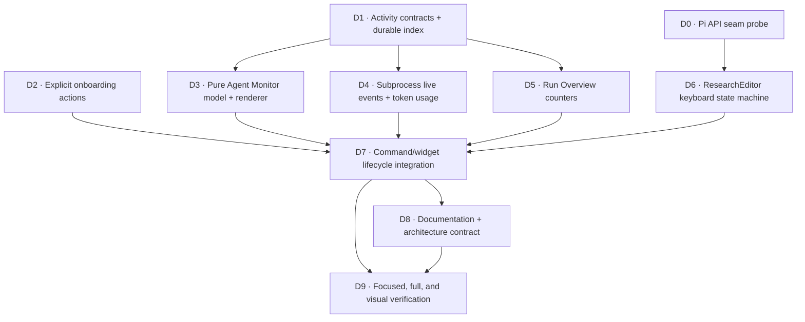

# Autoresearch Agent Monitor UI — DAG Implementation Plan

**Status:** Implemented

**Design source:** [Autoresearch Agent Monitor UI Plan](./2026-07-26-autoresearch-agent-monitor-ui.md)

## Objective

Implement the complete UI redesign as independently testable modules:

- explicit onboarding Continue/Cancel actions;
- one compact Agent Monitor above the Composer with Overview and Focus views;
- keyboard navigation without typed inspection commands;
- a compact below-composer Control Deck;
- durable agent invocation history and token accounting;
- restart-safe remote and experiment counters.

## First-Principles Decomposition

The implementation has five separate concerns:

1. **Truth:** durable invocation, usage, experiment, and submission data.
2. **Projection:** pure models that turn truth into rows, traces, and counters.
3. **Rendering:** terminal-width-aware text/components with no orchestration
   side effects.
4. **Input:** a keyboard state machine that arbitrates navigation and ordinary
   Composer editing.
5. **Lifecycle:** command code that installs, updates, and restores the UI.

No renderer should read files directly, no persistence module should know Pi UI
APIs, and no input handler should own orchestration state.

## Dependency Graph



Critical path: `D0 → D6 → D7 → D9`.

## Parallel Work Waves

### Wave 1

Run concurrently:

- `D0` — root agent: inspect locked Pi interfaces and prove the input seam.
- `D1` — activity subagent: durable activity contracts and folding.
- `D2` — onboarding subagent: explicit action row and draft semantics.
- `D3` — monitor subagent: pure Overview/Focus state and rendering.

`D3` initially consumes a narrow structural interface declared in its own
module. Integration adapts durable activity records to that interface.

### Wave 2

After `D1`:

- `D4` — activity subagent: subprocess observer and detailed usage.
- `D5` — root agent: orchestrator/status counter projection.

After `D0`:

- `D6` — root agent: ResearchEditor or the supported Pi input-hook equivalent.

### Wave 3

After `D2` through `D6`:

- `D7` — root agent integrates all modules into command lifecycle and widgets.
- Subagents review focused failures in their owned modules.

### Wave 4

- `D8` — documentation can run beside focused regression fixes.
- `D9` — full typecheck, test suite, diff inspection, and artifact audit.

## Work Packages

### D0 — Pi API Seam Probe

**Owner:** root
**Writes:** no production files until the seam is confirmed

- Inspect `@earendil-works/pi-coding-agent@0.82.1` and
  `@earendil-works/pi-tui@0.82.1` declarations.
- Determine whether Pi supports replacing/wrapping the editor, registering a
  persistent input hook, or only command shortcuts.
- Write a focused interaction spike/test for delegation and cleanup.
- Select the smallest supported mechanism that preserves ordinary editor
  behavior.

**Exit condition:** a supported, testable way exists for NAV keys to reach the
Activity Navigator while ordinary typing still reaches the Composer.

### D1 — Activity Contracts and Durable Index

**Owner:** activity subagent
**Primary files:**

- `src/agent-activity.ts` (new)
- `src/agents/types.ts`
- `src/state.ts`
- `test/agent-activity.test.ts` (new)

**Produces:**

- stable invocation identity and attribution;
- append-only invocation lifecycle/activity records;
- safe fold/recovery from partial or duplicate records;
- summarized invocation rows independent of UI;
- detailed token usage type with an explicit completeness flag.

**Constraints:**

- Keep legacy `AgentTask` and `AgentResult` callers source-compatible.
- Validate trace paths remain under `.autoresearch/`.
- Persist identity/start before externally visible child-agent work.

### D2 — Explicit Onboarding Actions

**Owner:** onboarding subagent
**Primary files:**

- `extensions/autoresearch/config-ui.ts`
- `test/config-ui.test.ts`
- `test/ui/config-interaction.test.ts`

**Produces:**

- visible Continue/Cancel action row in onboarding mode;
- explicit `continue` and `cancel` result values;
- Escape/Ctrl-C cancellation;
- navigation into and out of the action row;
- tests proving Continue is required to advance.

**Constraint:** avoid `commands.ts`; root integrates the new results and draft
config semantics to prevent overlap.

### D3 — Pure Agent Monitor Model and Renderer

**Owner:** monitor subagent
**Primary files:**

- `extensions/autoresearch/agent-monitor.ts` (new)
- `extensions/autoresearch/trace-view.ts` (new if separation helps)
- `test/agent-monitor.test.ts` (new)
- `test/trace-view.test.ts` (new if separation helps)

**Produces:**

- stable ID selection;
- frozen order while navigation is active;
- Overview/Focus transitions;
- invocation switching;
- bounded roster and trace windows;
- follow-bottom behavior;
- compact single-frame text rendering at wide and narrow widths;
- semantic conversion of known Pi JSONL events.

**Constraint:** consume plain records and return lines/state transitions; do not
import command or orchestrator modules.

### D4 — Subprocess Live Events and Token Usage

**Owner:** activity subagent after D1
**Primary files:**

- `src/agents/subprocess.ts`
- `test/subprocess.test.ts`

**Produces:**

- optional live observer at the `AgentRunner` boundary;
- durable start/activity/usage/terminal events;
- detailed input/output/cache token parsing;
- complete-line-only streaming;
- no duplicated usage on final-buffer processing;
- abort, timeout, malformed event, and retry coverage.

### D5 — Run Overview Counters

**Owner:** root
**Primary files:**

- `src/orchestrator.ts`
- `src/metaharness.ts`
- `extensions/autoresearch/widget.ts`
- related status/widget tests

**Produces:**

- Stage from durable phase;
- lifetime sealed experiment count;
- unique server-confirmed harness accept count;
- other remote submission count from current/cached snapshot;
- current inner-loop token total.

**Constraints:**

- count from durable evidence, not in-memory UI events;
- preserve legacy state and offline cached-leaderboard behavior;
- never equate accepted with promoted.

### D6 — ResearchEditor Keyboard State Machine

**Owner:** root
**Primary files:**

- `extensions/autoresearch/research-editor.ts` (new, if editor wrapping is supported)
- `test/ui/research-editor-interaction.test.ts` (new)

**Produces:**

- NAV/TYPE focus states;
- Up/Down selection, Enter Focus, Escape Overview;
- Left/Right invocation switching and Focus scrolling;
- printable-key handoff without losing the first character;
- restoration of the original editor/input behavior.

**Constraint:** use only the supported seam selected in D0. If direct editor
wrapping is unavailable, document the nearest supported keybinding behavior
and keep the state machine independent.

### D7 — Command and Widget Lifecycle Integration

**Owner:** root
**Primary files:**

- `extensions/autoresearch/commands.ts`
- `extensions/autoresearch/widget.ts`
- `test/commands.test.ts`
- `test/widget.test.ts`
- `test/pty/visible-screen.test.ts`

**Produces:**

- Agent Monitor above the Composer;
- compact Control Deck below the Composer;
- Activity Navigator linked to monitor selection;
- removal of Candidate and Live Activity sections;
- installation on run/resume and restoration on stop/failure/unload;
- RPC-safe string-array fallback;
- onboarding draft applied only on Continue.

### D8 — Documentation

**Owner:** available subagent or root
**Primary files:**

- `README.md`
- `docs/architecture.md`
- `test/architecture.test.ts`

Document the shared vocabulary, keyboard contract, durable invocation index,
counter semantics, restart behavior, and read-only Focus mode.

### D9 — Verification

**Owner:** root

Run:

```bash
npm run typecheck
npm test
git diff --check
git status --short
```

Also verify:

- no real challenge submit/sync;
- no paid agent calls;
- no `.autoresearch/`, logs, scores, traces, worktrees, or temporary files;
- no unrelated changes;
- all installed UI components/timers/listeners restore on every terminal path.

## Integration Contracts

### Monitor input

```ts
interface MonitorAgent {
  invocationId: string;
  role: string;
  label: string;
  status: "running" | "waiting" | "complete" | "failed" | "interrupted";
  phase?: string;
  activity?: string;
  attempt?: number;
  maxAttempts?: number;
  startedAt: string;
  completedAt?: string;
  tracePath?: string;
  tokens?: number;
}
```

### Control actions

```ts
type MonitorAction =
  | { type: "select"; invocationId: string }
  | { type: "focus"; invocationId: string }
  | { type: "overview" }
  | { type: "switchInvocation"; direction: -1 | 1 }
  | { type: "scroll"; delta: number }
  | { type: "followLatest" };
```

### Render ownership

- `AgentMonitor` owns monitor lines and view state.
- `ResearchEditor` owns input focus and emits `MonitorAction`.
- `commands.ts` wires actions to state and requests renders.
- `widget.ts` renders Run Overview and Controls from already-computed values.
- `agent-activity.ts` owns durable invocation truth and token aggregation.

## Merge and Conflict Rules

- Subagents edit only their assigned primary files.
- Shared integration files (`commands.ts`, `widget.ts`, `orchestrator.ts`) stay
  with root.
- Root adapts interfaces during integration instead of asking two subagents to
  edit the same file.
- Existing user-authored files and unrelated changes are preserved.
- No commits or staging unless explicitly requested.

## Definition of Done

The implementation is complete only when all ten acceptance criteria in the
design plan pass, the full repository gates are green, and the active DAG has
no unfinished node.

## Completion Record

All DAG nodes `D0` through `D9` are complete.

- The root agent owned the Pi seam, ResearchEditor, Run Overview counters,
  command/widget integration, PTY contract, and final verification.
- The activity subagent owned durable invocation truth, subprocess events,
  token accounting, recovery folding, and focused tests.
- The onboarding subagent owned explicit Continue/Cancel behavior and later
  documented the final architecture and vocabulary.
- The monitor subagent owned the pure Overview/Focus model, compact renderer,
  semantic trace projection, and incremental file tailer.
- Integration preserved file ownership until the shared seams were ready, then
  root wired those seams without parallel edits to the same files.

Verification completed on 2026-07-26:

```text
npm run typecheck
npm test                  43 files, 261 tests passed
git diff --check
real Pi PTY smoke         3 tests passed
```
